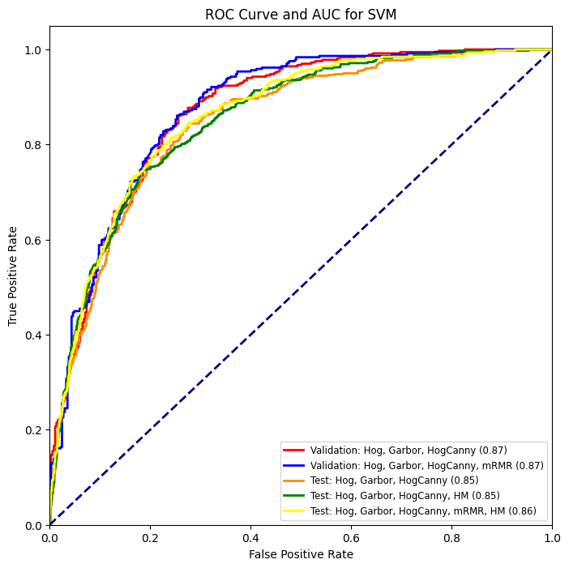

# Wrist-Fracture-Detection
This repository contains the code for the project "Wrist Fracture Detection" which is a part of the course "Medical Image Analysis" at the University of Cassion.

This code is the first stage of the Wrist Fracture Detection pipeline, which aims to generate propose regions for further steps.

## Image Preprocessing Pipeline
For this approach, two critical stages are essential: 
-  Image Preprocessing to enhance image quality, highlight key features, and isolate regions of interest, ensuring successful bone segmentation. 
-  Feature Extraction to identify and capture meaningful patterns and structures from the processed images using various descriptors, which are vital for accurate and efficient subsequent analysis.


## Feature Extraction 
Iterations over each image have been performed using a sliding window approach, extracting patches (windows) of 64 pixels in size, with a step size of 32 pixels.


## Model Training

### Model Selection
- LightGBM: with learning rate of 0.05 and 150 estimators
- SVM: with C = 100, gamma = 0.1, and kernel = 'rbf'
### Feature Selection
-  Minimum Redundancy Maximum Relevance (mRMR) [7] method to select the most relevant features from the dataset, improving model performance, and reducing complexity and the risk of overfitting
- The best results achieved with the 600 features
### HardMining
- Hard negative mining was performed using the most accurate model to identify misclassified samples from the validation set and add them to the training set, followed by retraining the model. By focusing on hard negatives, the model learns from its mistakes, potentially improving performance on difficult cases.


## Useage
### Install requirements
```bash
pip install -r requirements.txt
```
### Inference
Recommend to use the default parameters to infer the images. 
Enable show to visualize the images with the bounding box. 
Provide labels_folder to compare the results with the ground truth.
```bash
python infer.py
```
- --infer_path: the path to the folder containing the images to be inferenced
- --model_path: the path to the model weights
- --save_path: the path to the folder to save the images
- --show: whether to show the image with the bounding box
- --window_size: the size of the window to extract the patch
- --step_size: the step size of sliding window
- --pool_kernel: the kernel size of max pooling
- --mean_hist: the path to the mean histogram of the training dataset
- --heatmap: the path to the probability map of the heatmap
- --model_path: the path to the model weights
- --scaler: the path to the scaler
- --labels_folder: the path to the folder containing the labels


## Results
### Comparison between different models and features
| Model      | Features                             | Class        | Precision | Sensitivity | Specificity | F1 Score |
|------------|--------------------------------------|--------------|-----------|-------------|-------------|----------|
| LightGBM   | Hog                                  | Non-Fracture | 0.94      | 0.73        | 0.78        | 0.82     |
|            |                                      | Fracture     | 0.40      | 0.78        | 0.73        | 0.53     |
|            | Hog + Gabor                          | Non-Fracture | 0.93      | 0.75        | 0.78        | 0.83     |
|            |                                      | Fracture     | 0.40      | 0.75        | 0.75        | 0.52     |
|            | Hog + Gabor + HogCanny               | Non-Fracture | 0.94      | 0.75        | 0.78        | 0.83     |
|            |                                      | Fracture     | 0.42      | 0.78        | 0.75        | 0.54     |
|            | Hog + Gabor + HogCanny + HM          | Non-Fracture | 0.94      | 0.75        | 0.78        | 0.84     |
|            |                                      | Fracture     | 0.42      | **0.79**    | 0.76        | 0.55     |
| SVM        | Hog + Gabor + HogCanny               | Non-Fracture | 0.93      | 0.80        | 0.78        | 0.86     |
|            |                                      | Fracture     | 0.46      | 0.75        | 0.75        | 0.57     |
|            | Hog + Gabor + HogCanny + HM          | Non-Fracture | 0.93      | 0.79        | 0.78        | 0.86     |
|            |                                      | Fracture     | 0.45      | 0.75        | 0.76        | 0.57     |
|            | Hog + Gabor + HogCanny + mRMR + HM   | Non-Fracture | **0.94**  | **0.80**    | 0.78        | **0.86** |
|            |                                      | Fracture     | **0.47**  | 0.76        | 0.76        | **0.58** |

### AUC-ROC Curve


# Reference
[1] https://github.com/smazzanti/mrmr

